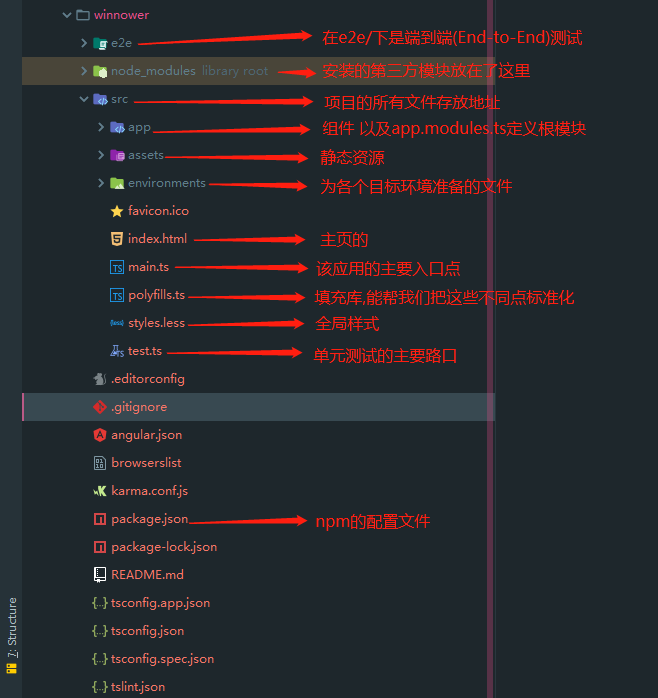
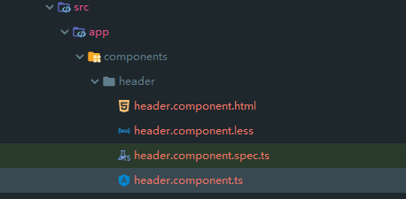

### 前提条件
> 在开始之前，请确保你的开发环境中包括 Node.js® 和 npm 包管理器。

### 安装 Angular CLI
> 你可以使用 Angular CLI 来创建项目、生成应用和库代码，以及执行各种持续开发任务，比如测试、打包和部署。</br>
要使用 npm 命令安装 CLI，请打开终端/控制台窗口，输入如下命令：</br>**`npm install -g @angular/cli`**

### 创建工作空间和初始应用
> `ng new winnower`</br>
* 添加路由选项
* 样式编写语言采用`less`
* 逻辑处理语言采用`Typescript`

### 项目文件说明
</br>

### 启动应用
* `cd winnower`
* `ng serve --open`
  ```angular
  F:\webStrom_works\learn_angular\project\winnower>ng serve --open

  Date: 2019-06-26T02:38:44.601Z
  Hash: bad7248a9516db6dae4e
  Time: 7103ms
  chunk {main} main.js, main.js.map (main) 11.4 kB [initial] [rendered]
  chunk {polyfills} polyfills.js, polyfills.js.map (polyfills) 248 kB [initial] [rendered]
  chunk {runtime} runtime.js, runtime.js.map (runtime) 6.08 kB [entry] [rendered]
  chunk {styles} styles.js, styles.js.map (styles) 16.5 kB [initial] [rendered]
  chunk {vendor} vendor.js, vendor.js.map (vendor) 3.94 MB [initial] [rendered]
  ** Angular Live Development Server is listening on localhost:4200, open your browser on http://localhost:4200/ **
  ```

### `app.module.ts`组件分析
```typescript
import { BrowserModule } from '@angular/platform-browser';//浏览器解析模块
import { NgModule } from '@angular/core';//angular核心模块

import { AppRoutingModule } from './app-routing.module';//路由模块
import { AppComponent } from './app.component';//根组件

/* @NgModule接收一个元数据对象,告诉Angular如何编译和启动应用 */
@NgModule({
  declarations: [//引入当前项目运行的组件
    AppComponent
  ],
  imports: [//引入当前模块运行依赖的其它组件
    BrowserModule,
    AppRoutingModule
  ],
  providers: [],//定义的服务
  bootstrap: [AppComponent]//指定应用的主视图(跟组件),通过引导根AppModule来启动应用,这里一般写根组件
})
// 根模块不需要导出任何东西,因为其它组件不需要根模块,但是一定要写
export class AppModule { }
```

### 自定义组件
* 创建自定义组件
  * `ng g component components/header`
    * 在`src/app`下创建`components/header`文件夹,并声明`header`组件</br>
      </br>
* 组件内容详解
  ```typescript
  import { Component, OnInit } from '@angular/core';// 引入angular核心

  @Component({
    selector: 'app-header',// 组件名称
    templateUrl: './header.component.html',// html模板
    styleUrls: ['./header.component.less'] //样式模板
  })
  export class HeaderComponent implements OnInit { // 实现接口

    constructor() { // 构造函数

    }

    ngOnInit() { // 初始化加载声明周期函数
    }

  }
  ```

### 组模板介绍
#### 绑定数据
```xml
<h1>
{{title}}
</h1>
<div>
1+1={{1+1}}
</div>
```
#### 绑定HTML
```typescript
this.h="<h2>这是一个 h2 用[innerHTML]来解析</h2>"
```
```xml
<div [innerHTML]="h"></div>
```
#### 绑定属性
```typescript
classes = "ggg";
```
```xml
<p [class] = "classes">header works!</p>
```
### 数据循环
#### 普通循环
```typescript
arr = [1,2,3,4,5,6,7,8,9]
```
```xml
<ul>
  <li *ngFor="let item of arr">
    {{item}}
  </li>
</ul>
```
#### 循环的时候设置 key
```xml
<ul>
  <li *ngFor="let item of arr;let i = index;">
    {{item}} --{{i}}
  </li>
</ul>
```
### 条件判断
```xml
<div ngif="arr.length > 3">
  <div>{{arr.length}}</div>
</div>
```
### Switch
```typescript
public score = 3;
```
```xml
<ul [ngSwitch]="score">
  <li *ngSwitchCase="1">选项是1</li>
  <li *ngSwitchCase="2">选项是2</li>
  <li *ngSwitchCase="3">选项是3</li>
  <li *ngSwitchCase="4">选项是4</li>
  <li *ngSwitchCase="5">选项是5</li>
</ul>
```
### 执行事件
```typescript
clickthis(){
  alert("这是一个点击事件")
}
```
```xml
<div (click)="clickthis()">点击我</div>
```
### 表单事件
```typescript
keyUpFn(e){
  console.log(e)
}
```
```xml
<input type="text" (keyup)="keyUpFn($event)"/>
```
### 双向数据绑定
**要引入FormsModule**
```typescript
import { FormsModule } from '@angular/forms'
@NgModule({
  declarations: [//引入当前项目运行的组件
    AppComponent, HeaderComponent
  ],
  imports: [//引入当前模块运行依赖的其它组件
    BrowserModule,
    FormsModule,
    AppRoutingModule
  ],
  providers: [],//定义的服务
  bootstrap: [AppComponent]//指定应用的主视图(跟组件),通过引导根AppModule来启动应用,这里一般写根组件
})
```
<hr>

```typescript
public inputValue = "aaa";
```
```xml
<input [(ngModel)]="inputValue">
<div>{{inputValue}}</div>
```
### `ngClass`
```xml
<div [ngClass]="{'class1':true,'class2':false}">根据数据主动配置class属性</div>
```
### `ngStyle`
```xml
<span [ngStyle]="{'color':'red'}">根据ngstyle主动配置字体颜色</span>
```
### 管道
```typescript
public today = new Date();
```
```xml
<p>{{today | date:'yyyy-MM-dd HH:mm:ss' }}</p>
```
### dom节点的操作
```typescript
import { Component, OnInit ,AfterViewInit} from '@angular/core';
ngAfterViewInit(){ // dom节点渲染完成后进行操作(建议把dom的操作放在这里)
  let a:any = document.getElementById("testDom");
  a.style.color = 'red';
}
```
```xml
<span id="testDom">dom节点操作</span>
```
### 父组件调用子组件的属性和方法
* `news`为父组件,`header`为子组件
  * 当`news`调用子组件`header`时,在标签上添加该内容
    ```xml
    <app-header #footerChild>KKKKK</app-header>
    ```
  * 然后在ts里面进行声明
    ```typescript
    import { Component, OnInit, ViewChild } from '@angular/core';
    // @ts-ignore 把子组件初始化到父组件中
    @ViewChild('footerChild') headercomponent: any;
    constructor() {

    }
    // tslint:disable-next-line:use-lifecycle-interface
    ngAfterViewInit(): void {
      // 执行子组件中的aaa函数的方法
      this.headercomponent.aaa();
    }
    ```

### 父组件给子组件传值-@input
#### 父组件相关配置
```typescript
public jbk = '这是jbk';
```
```xml
<app-header [msg] = "jbk"></app-header>
```
#### 子组件相关配置
```typescript
import { Component, OnInit , AfterViewInit, Input} from '@angular/core';
@Input() msg: string;
```
```xml
<input [(ngModel)]="msg">
<span>{{msg}}</span>
```
### 子组件调用父组件的方法(子组件通过@Output 触发父组件的方法)
#### 子组件相关配置
```typescript
import { Component, OnInit , AfterViewInit, Input, Output, EventEmitter} from '@angular/core';
@Output() private outer = new EventEmitter<string>();
// 点击事件触发
sendParent() {
  // 向外广播信息
  this.outer.emit('该消息来自子组件');
}
```
```xml
<div (click)="sendParent($event)">点击我(子组件),调用父组件的方法</div>
```
#### 父组件相关配置
```typescript
runParent(e) {
  alert(e);
}
```
```xml
<app-header (outer) = "runParent($event)"></app-header>
```
